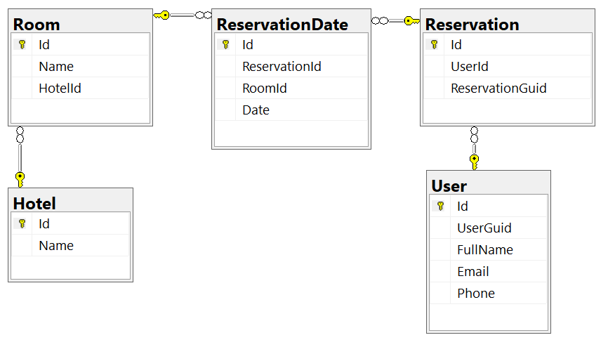

# Hotel Booking API
.NET Web API application for booking hotel rooms

# Technologies
- REST API built with .NET 6.0 and Visual Studio 2022
- Entity Framework Core 
- SQL Server database
- Swashbuckle.AspNetCore.Swagger
- AutoMapper

# Getting Started
## Requirements
- [.NET 6.0 SDK](https://dotnet.microsoft.com/en-us/download/dotnet/6.0)
- [SQL Server 2019 Express](https://www.microsoft.com/en-us/sql-server/sql-server-downloads)

## Steps
- Clone repository
- Update the ConnectionStrings:HotelBookingDatabase in the appsettings.json file (in the HotelBooking.API project) with your local SQL Server information
- In the Package Manager Console (targeting the DataAccess.EF project) run the command ``Update-Database`` to deploy the database
- You can now build and run the application (In Visual Studio, before starting the app, make sure the API project is set as the default Startup project) 

# Database diagram

 
The API supports the booking of several rooms (in different hotels) through the tables Room and Hotel.

Each reservation (Reservation table) must be associated to a user (User table).

The ReservationDates table determines the dates and rooms for each reservation. It contains a unique constraint over the RoomId and Date fields, making the data consistent with the fact that no room can be booked for the same date more than once.

# Future improvements
- Add authentication with JWT.
- Add attributes to handle authorization to specific resources (like rights to modify a specific reservation).
- Add Unit Tests.
- Add Admin section to handle features with higher privileges.
- Add API Health Check.
- Add Audit logs to log important operations (like removing reservations).
- Create Postman collection.
- Implement Fluent Validation library to improve the validation of the business rules.

